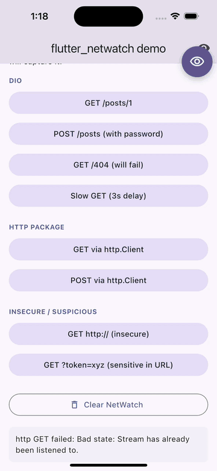

# flutter_netwatch

A production-grade Flutter HTTP inspector with sensitive data masking, cURL export, Postman export, security analysis, floating bubble UI, and QA-ready notifications.

[](https://www.mujtaba.cc/)
[](https://buymeacoffee.com/immujtaba9h)

## Demo

<p align="center">
  
</p>

The recording shows a real Flutter app running with `flutter_netwatch` wired in:

1. The app fires HTTP requests through Dio.
2. Each request shows up live in the floating bubble (top-right) with an unseen-count badge.
3. Tap the bubble to open the full-screen inspector — list filters by 2xx / 3xx / 4xx / 5xx / slow / errors.
4. Tap a transaction to inspect URL, headers, body, and security analysis.
5. Toggle the lock icon to mask sensitive headers / fields / query params live.
6. FAB **Export** opens cURL, Postman, and plain-text export options.

> Full-quality MP4: [assets/demo.mp4](assets/demo.mp4)

- **Zero navigator conflicts** — works with any `MaterialApp` setup
- **Runtime-configurable** via `NetWatchConfig.enabled`
- **Sealed classes** throughout — exhaustive pattern matching
- **No native dependencies** — pure Flutter Overlay
- Supports **Dio**, **http**, and **Chopper**

## Install

```yaml
dependencies:
  flutter_netwatch: ^0.2.1
```

## Setup

```dart
import 'package:flutter/material.dart';
import 'package:flutter_netwatch/flutter_netwatch.dart';
import 'package:dio/dio.dart';

void main() {
  WidgetsFlutterBinding.ensureInitialized();

  NetWatch.initialize(
    config: NetWatchConfig(
      enabled: true,
      maskSensitiveData: true,
      showFloatingBubble: true,
      showNotifications: true,
      maxTransactions: 200,
      performanceBudgetMs: 1000,
    ),
  );

  final dio = Dio();
  dio.interceptors.add(NetWatch.dioInterceptor);

  runApp(MyApp());
}

class MyApp extends StatelessWidget {
  @override
  Widget build(BuildContext context) {
    return MaterialApp(
      builder: NetWatch.builder, // only required change
      home: HomeScreen(),
    );
  }
}
```

## Three setup scenarios — all work without conflict

### A) No existing navigator key

```dart
MaterialApp(
  builder: NetWatch.builder,
  home: HomeScreen(),
)
```

### B) Existing key + observer

```dart
MaterialApp(
  navigatorKey: myKey,
  navigatorObservers: [NetWatch.observer],
  builder: NetWatch.builder,
)
```

### C) Existing key only — zero observer

```dart
MaterialApp(
  navigatorKey: myKey,
  builder: NetWatch.builder,
)
```

NetWatch never pushes routes onto your navigator. The inspector opens as an `OverlayEntry` over the app inside its own `Overlay`.

## Other clients

### http

```dart
import 'package:http/http.dart' as http;

final client = NetWatch.httpClient(http.Client());
await client.get(Uri.parse('https://api.example.com/users'));
```

### Chopper

```dart
final chopperClient = ChopperClient(
  interceptors: [NetWatch.chopperInterceptor],
);
```

## Features

### In-app inspector

Tap the floating bubble (or call `NetWatch.open()`) to launch the full-screen inspector. Filter by status (2xx, 3xx, 4xx, 5xx, slow, errors), search by URL/method/status, and tap any row for full request/response/security details.

### Sensitive data masking

Headers like `Authorization`, `Cookie`, `X-API-Key`, body fields like `password`, `token`, `secret`, and URL query params like `?token=...` are masked automatically. Toggle masking on/off live in the UI — affects every export.

```dart
NetWatch.initialize(
  config: NetWatchConfig(
    sensitiveHeaders: [
      ...NetWatchConfig.defaultSensitiveHeaders,
      'x-my-custom-token',
    ],
    sensitiveBodyFields: [
      ...NetWatchConfig.defaultSensitiveBodyFields,
      'pin_code',
    ],
  ),
);
```

### Exporters

- **cURL** — copy/share any request as a runnable cURL command.
- **Postman** — export single request or full collection (Postman Collection v2.1).
- **HAR** — Chrome DevTools / Charles / Insomnia / Fiddler-compatible.
- **Plain text** — share complete request/response details.

### Replay

Re-fire any captured request with one tap from the detail screen. Register a replayer once with the same HTTP client you're already capturing through:

```dart
final dio = Dio();
dio.interceptors.add(NetWatch.dioInterceptor);
NetWatch.registerReplayer(NWDioReplayer(dio));   // ← one line
```

For `http`:

```dart
final client = NetWatch.httpClient(http.Client());
NetWatch.registerReplayer(NWHttpClientReplayer(client));
```

For Chopper or any custom client:

```dart
NetWatch.registerReplayer(NWCustomReplayer(
  canHandle: (req) => req.url.host == 'api.mybackend.com',
  replay: (req) async {
    // re-fire `req` through your client of choice
  },
));
```

The Replay FAB only appears when at least one registered replayer's `canHandle()` returns true for that request — so you can register multiple replayers and route by host or method.

### GraphQL pretty-print

NetWatch detects GraphQL operations on the wire automatically. The transaction list shows the operation name (`GetUserProfile`, `UpdateOrder`, etc.) instead of the path, with a magenta `GQL` badge. The detail screen splits the body into `query` / `variables` / `data` / `errors` sections.

### Stats screen

Tap the bar-chart icon in the inspector AppBar for a live dashboard: total / success / failure / success-rate, avg / p95 / max duration, top-5 slowest endpoints, top-5 most-failing endpoints, and a per-host bar chart.

### Security analysis

Each captured request is checked for:
- HTTPS usage
- HSTS / X-Content-Type-Options / CSP headers
- Sensitive data in URL query params
- Basic auth scheme usage

A rating (`good` / `warning` / `critical`) is computed per request.

### Performance budget

Requests slower than the configured budget (`performanceBudgetMs`, default 1000ms) are flagged as `NWStatusSlow`.

## Programmatic API

```dart
NetWatch.open();              // open inspector
NetWatch.clear();             // clear captured transactions
NetWatch.transactions;        // List<NWTransaction>
NetWatch.transactionStream;   // Stream<List<NWTransaction>>
NetWatch.isActive;            // reflects initialize() + config.enabled
```

## Enable or disable NetWatch explicitly

NetWatch follows `NetWatchConfig.enabled` in every build mode. When `enabled` is `false`:
- `NetWatch.builder` becomes a pass-through wrapper.
- Interceptors are no-ops — they call `handler.next()` immediately.
- The core singleton stays inactive and no transactions are stored.

When `enabled` is `true`, capture and UI stay available even in release builds. That makes it possible to profile real release performance while still inspecting live HTTP traffic.

## Related Packages

- [flutter_release_checklist](https://pub.dev/packages/flutter_release_checklist) — Pre-release security and quality CLI

## Author

Built by **[Mujtaba](https://www.mujtaba.cc/)** — software engineer working on Flutter, AI, and developer tooling.

## Support

If this package saves your team time, consider sponsoring:

[](https://github.com/sponsors/iammujtaba44)
[](https://buymeacoffee.com/immujtaba9h)

## License

MIT
